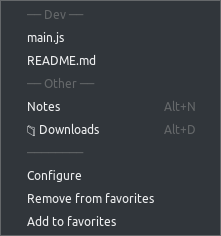

favorites
==========
Registers **File->Favorites** menu with commands for accessing files and folders of choice.



**Install**

```apm install favorites```

**Settings**

```cson
favorites:
  paths: [
    "topic:Dev"
    "/main.js"
    "/README.md"
    "topic:Other"
    "key:alt-n|name:Notes|/notes.txt"
    "key:alt-d|/Downloads"
  ]
  showInCommandPalette: false
  showInContextMenus: true
```
Options
* showInCommandPalette - show/hide favorites in command palette (defaults to false)
* showInContextMenus - show/hide favorites in tree-view and editor context menus (defaults to true)

Known Issues
* Manually adding paths in config.cson may cause 'Path not found in tree view' errors due to wrong case or other mismatches. Make sure favorites are always added with 'Add to favorites' command.


**License** [MIT](https://github.com/gliviu/atom-favorites/blob/master/LICENSE)

[Issues and suggestions](https://github.com/gliviu/atom-favorites/issues)
