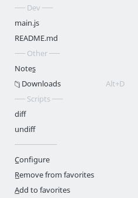

favorites
==========
Registers ```File->Favorites``` menu with commands that allows you to create shortcuts to favorite files and folders.

**Install**

```apm install favorites```

**Settings**

```File->Favorites->Configure``` will direct to settings section in ```config.cson```.

```cson
favorites:
  paths: [
    "topic:Dev"               # Define category
    "/main.js"
    "/README.md"
    "topic:Other"
    "name:Note&s|/notes.txt"  # Rename favorite. Specify accelerator key with '&'
    "key:alt-d|/Downloads"    # Assign shortcut key
    "topic:Scripts"
    "name:diff|key:alt-s d|/scripts/diff.sh"
    "name:undiff|key:alt-s u|/scripts/undiff.sh"
  ]
  menuLocation: "F&avorites"
  showInCommandPalette: false
  showInContextMenus: true
```



See [Atom key combinations](https://flight-manual.atom.io/behind-atom/sections/keymaps-in-depth/#key-combinations) for more key-binding details.

**Options**
* menuLocation - Location of favorites menu (defaults to 'File/Fa&vorites')
* showInCommandPalette - show/hide favorites in command palette (defaults to false)
* showInContextMenus - show/hide favorites in tree-view and editor context menus (defaults to true)

**Known Issues**
* Manually adding paths in config.cson may cause ```Path not found in tree view``` errors due to wrong case or other mismatches. Make sure favorites are always added with 'Add to favorites' command.


**License**

[MIT](https://github.com/gliviu/atom-favorites/blob/master/LICENSE)

[Issues and suggestions](https://github.com/gliviu/atom-favorites/issues)
